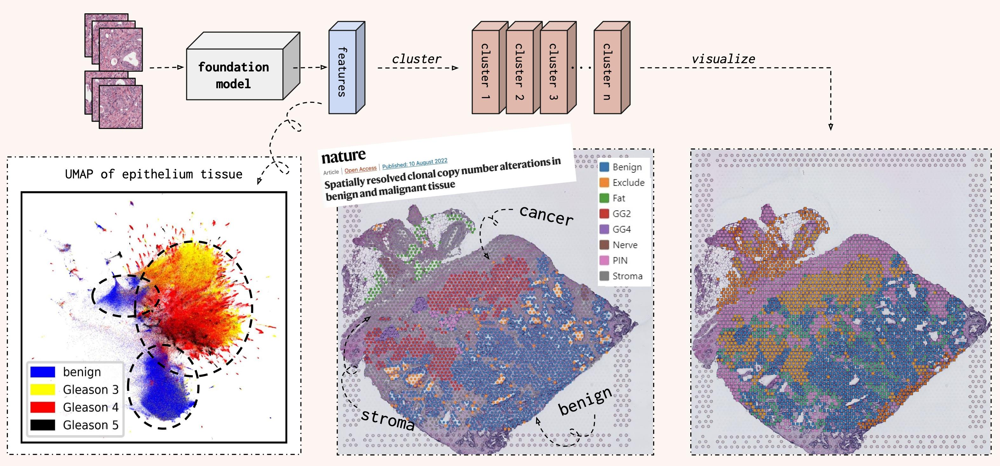

<div align="center">

# HistoEncoder
Foundation models for digital pathology.


<p align="center">
  <a href="#description">Description</a> •
  <a href="#why">Why?</a> •
  <a href="#installation">Installation</a> •
  <a href="#usage">Usage</a> •
  <a href="https://jopo666.github.io/HistoEncoder/">API Documentation</a> •
  <a href="#citation">Citation</a>
</p>

</div>

## Description

`HistoEncoder` CLI interface allows users to *_extract_* and *_cluster_* useful features for
histological slide images. The `histoencoder`
python package also exposes some useful functions for using the encoder models, which
are described in the [API docs](https://jopo666.github.io/HistoEncoder/).

## Why?

The models provided in this package _produce similar features for tile images with
similar histological patterns_. This means that when we cluster the tile images based on
their features, each cluster contains tile images with similar histological patterns.

Thus, visualising the clusters allows us to automatically annotate whole datasets!
Additionally, calculating cluster percentages for a given patient would give us the
distribution of histological patterns for the patient. This information could then be
combined with other data modalities.


## Installation

```bash
pip install histoencoder
```

## Usage

1. Cut histological slide images into small tile images with
   [`HistoPrep`](https://github.com/jopo666/HistoPrep).

```bash
HistoPrep --input './slide_images/*.tiff' --output ./tile_images --width 512 --overlap 0.5 --max-background 0.5
```

2. Extract features for each tile image.

```bash
HistoEncoder extract --input ./tile_images --model-name prostate-small
```

3. Cluster extracted features.

```bash
HistoEncoder cluster --input ./tile_images
```

Now `train_tiles` contains a directory for each slide with the following contents.

```bash
train_tiles
└── slide_image
    ├── clusters.parquet # Clusters for each tile image.
    ├── features.parquet # Extracted features for each tile.
    ├── metadata.parquet # Everything else is generated by HistoPrep.
    ├── properties.json
    ├── thumbnail.jpeg
    ├── thumbnail_tiles.jpeg
    ├── thumbnail_tissue.jpeg
    └── tiles  [52473 entries exceeds filelimit, not opening dir]
```

## Citation

If you use `HistoEncoder` models or pipelines in your publication, please cite the github repository.

```
@misc{histoencoder,
  author = {Pohjonen, Joona},
  title = {HistoEncoder: Foundation models for digital pathology},
  year = {2023},
  publisher = {GitHub},
  journal = {GitHub repository},
  howpublished = {https://github.com/jopo666/HistoEncoder},
}
```
