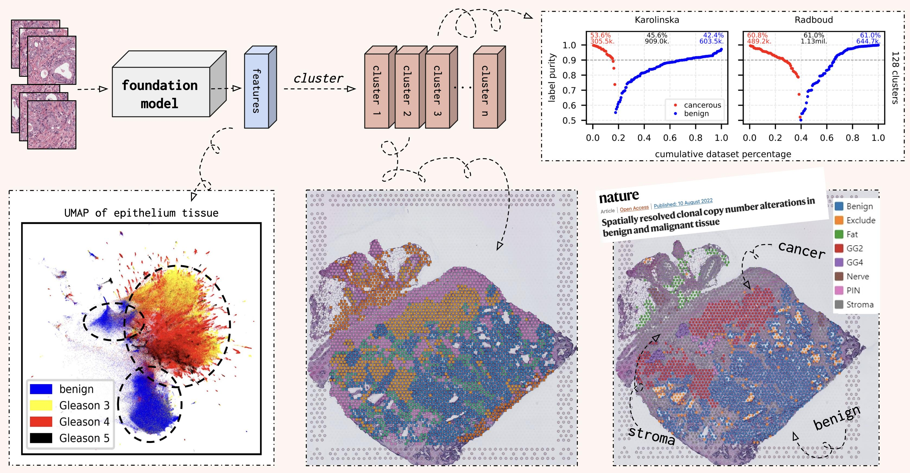

<div align="center">

# HistoEncoder
Foundation models for digital pathology.


<p align="center">
  <a href="#description">Description</a> •
  <a href="#what-is-this">What???</a> •
  <a href="#installation">Installation</a> •
  <a href="#usage">Usage</a> •
  <a href="https://jopo666.github.io/HistoEncoder/">API Documentation</a> •
  <a href="#citation">Citation</a>
</p>

</div>

## Description

`HistoEncoder` CLI interface allows users to *_extract_* and *_cluster_* useful features for
histological slide images. The `histoencoder`
python package also exposes some useful functions for using the encoder models, which
are described in the [API docs](https://jopo666.github.io/HistoEncoder/).

## What is this?


Here, I've trained foundation models with massive amounts of data (prostate tissue) on
Europe's largest supercomputer
[LUMI](https://www.lumi-supercomputer.eu/first-finnish-lumi-projects-chosen-advancing-cancer-research-developing-digital-twins-of-the-earth-and-more/).
These foundation models are now freely shared to the public through this repository.
Let's go over some nice things these models are capable of...

During [self-supervised](https://github.com/facebookresearch/dino) pre-training, these
[models](https://github.com/facebookresearch/xcit) learn how **_produce similar features
for images with similar histological patterns_**. This is a really nice thing that
previous models haven't reeeally been able to do, and we can leverage that to do cool things.

When you feed in tile images (from histological slides), the model will _encode_ these
images into a feature vector. When we cluster these features, each cluster will contain
tile images with similar histological patterns (cuz that's what the model is good at)!
You can do this at a slide level or for a whole dataset to automatically annotate slide
images.



In the figure above, you can see UMAP representation of epithelium tissue of the
Radboud split of the [PANDA](https://www.kaggle.com/c/prostate-cancer-grade-assessment)
dataset. Here we can see that cancerous and benign epithelium form separate clusters,
and you can even rediscover the [Gleason grading
system](https://en.wikipedia.org/wiki/Gleason_grading_system) from the UMAP. 

Although UMAPs are pretty, they're kinda shitty for drawing any actual conclusions...
Thus, I also clustered all features in the PANDA dataset into 128 clusters. Then we can
calculate the propotion of tile images with cancerous or bengin tissue in each cluster.
This _label purity_ is visualised on the top right corner, and you can see that ~52% of
the 3.8 million tile images are contained in clusters with over 90% label purity!

To learn more, you can check out my [slides](docs/static/ECDP_2023.pdf) from the
[ECDP 2023](https://www.ecdp2023.org) seminar. We also have a preprint coming once I
finally finish writing it...

## What about [_input your tissue type here_]?

Although the first models in this repository (`prostate_small`, `prostate_medium`) have
been trained on only prostate tissue, they will very likely be better than any natural
image pre-trained model. Next step of this project/repository is to take the current
models and fine-tune them for other tissues to create other foundation models for new
tissue types (eg. `colon_*`, `breast_*` and so on). This fine-tuning step does not
require that much computing power so it's doable even though you don't have access to
thousands of GPUs.

If you're interest in fine-tuning the models for other tissue types, I'm happy to
help and share my training scripts/methods! Just send me an [email](mailto:joona.pohjonen@icloud.com)!

## Installation

```bash
pip install histoencoder
```

## Usage

### `HistoEncoder` command line interface

1. Cut histological slide images into small tile images with
   [`HistoPrep`](https://github.com/jopo666/HistoPrep).

```bash
HistoPrep --input "./slide_images/*.tiff" --output ./tile_images --width 512 --overlap 0.5 --max-background 0.5
```

2. Extract features for each tile image.

```bash
HistoEncoder extract --input_dir ./tile_images --model-name prostate_small
```

3. Cluster extracted features.

```bash
HistoEncoder cluster --input_dir ./tile_images
```

Now `train_tiles` contains a directory for each slide with the following contents.

```bash
train_tiles
└── slide_image
    ├── clusters.parquet # Clusters for each tile image.
    ├── features.parquet # Extracted features for each tile.
    ├── metadata.parquet # Everything else is generated by HistoPrep.
    ├── properties.json
    ├── thumbnail.jpeg
    ├── thumbnail_tiles.jpeg
    ├── thumbnail_tissue.jpeg
    └── tiles  [52473 entries exceeds filelimit, not opening dir]
```

### `histoencoder` module

If you already have tile images, or want to use your own programs for extracting tile
images, you can use the `histoencoder` python package! Check out the [API
docs](https://jopo666.github.io/HistoEncoder/) for more information.

```python
import histoencoder.functional as F

encoder = F.create_encoder("prostate_small")
for images in your_fancy_dataloader:
   features = F.extract_features(
     encoder, images, num_blocks=2, avg_pool=True
   )
   ...
```

## Citation

If you use `HistoEncoder` models or pipelines in your publication, please cite the
github repository. There's a preprint coming, but I wanted to share the model to the
public as quickly as possible! :)

```
@misc{histoencoder,
  author = {Pohjonen, Joona},
  title = {HistoEncoder: Foundation models for digital pathology},
  year = {2023},
  publisher = {GitHub},
  journal = {GitHub repository},
  howpublished = {https://github.com/jopo666/HistoEncoder},
}
```
